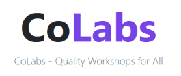

# WiityCliquesHackSVIT

### Problem:
> Providing students and researchers with best possible laboratories, workshops and other facilities without the hindrance of distance by shared usage of workshops and labs of other Institutions.

### Solution:
> Students can book slots for listed workshops  and laboratories, from the platform and access the physical workshops/labs.

> Students will get certificates, mentioning the number of hours spent at the facility.  

> Students can in turn show the Certificate provided and the fee receipt at their parent institution and claim a reimbursement .

### Tech Stacks Used: 

> Front end of our WebApp is majorly based on **HTML/CSS/Bootstrap/JavaScript**.
> **Firebase Authentication** will be used for secure User Access.
> Cloud **Firestore** will be used as the database.

### Dependencies:
> Firebase:
    Firebase will provide us the necessary Authentication and its cloud based Firestore will be used as the database for the project

> Razorpay:
    Razorpay API will be used as the payments platform for paying the lab charges.

> Google Maps API:
    It will be used to give user a Map based interface for
    while searching for laboratories.
    
## Problems faced while developing our project:
- Firebase 
        As all the members in our team had very little experience of using Firebase services like Authentication and Firestore, 
        it was bit challenging for us to implement it in our project.

- **Google Maps Distance Calculation and Sorting:**
        This also being a new experince, it took us bit time to figure out the algorithm and working.

- **Scope of the Solution**
        As now we've come back to normal and lockdowns being a thing of past, keep our solution relevant for today was bit mind-boggling.

**Link to our website**
https://dahighsky.github.io/WiityCliquesHackSVIT/
